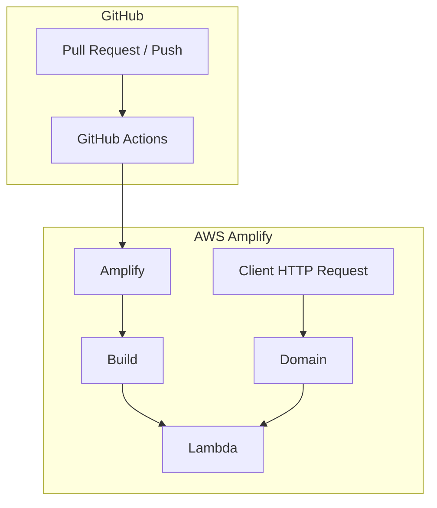
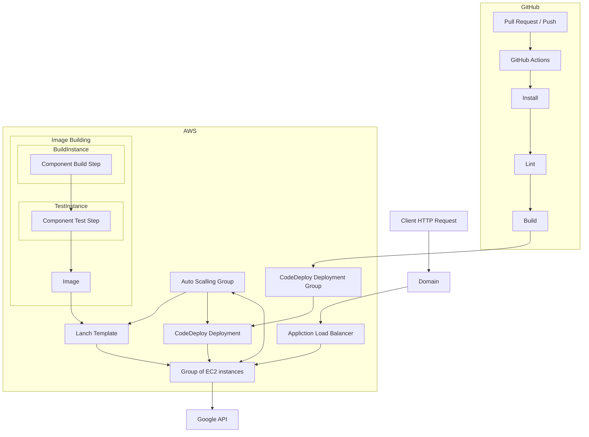
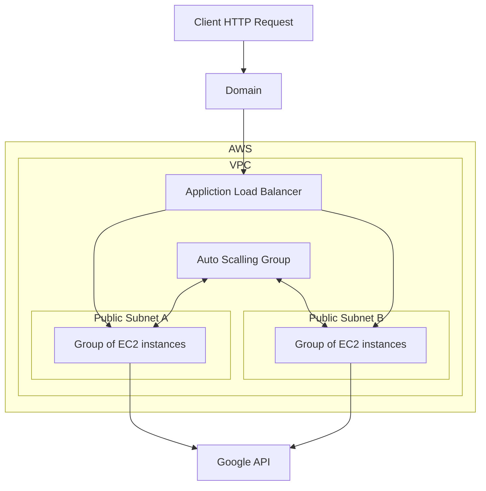
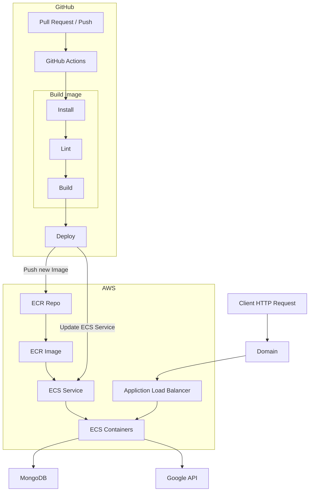
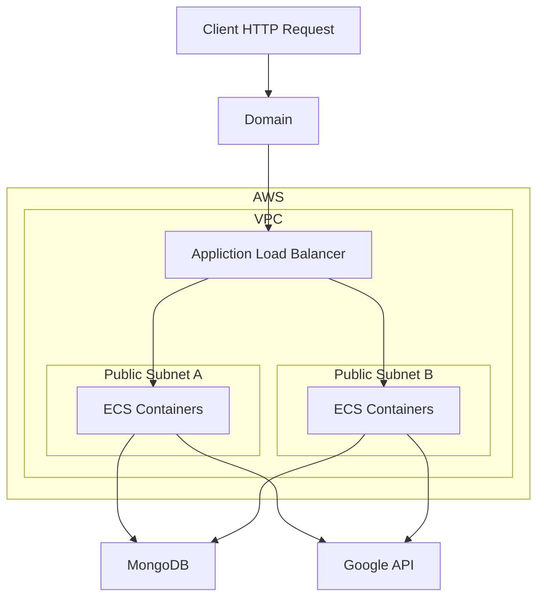

# madabclick

Science In A Click \
Quality content for children \

* Website: <https://madabclick-frontend.onrender.com/he/>
* Origin Website Link: <https://madabclick.madaney.net/he/>
* GitHub: <https://github.com/omer-priel/madabclick>
* Google Drive: <https://drive.google.com/drive/folders/1Jg3n8xkLEtAfkz5vPlV0N0s7QNT2TxU0>

## Technologies

* NextJS (React)
* TypeScript
* TailwindCSS
* Docker
* AWS
* Terraform

## Deployment

AWS Infrastructure - Amplify



AWS Infrastructure - EC2



AWS Networking Infrastructure - EC2



AWS Infrastructure - ECS



AWS Networking Infrastructure - ECS



Today it runs in render.com totally free

## Environment Variables

| Name                           | Description                             |
|--------------------------------|-----------------------------------------|
| APP_REVALIDATE                 | Time in seconds of rebuild the App Page |
| APP_STORAGE                    | Path for the storage directory          |
| GOOGLE_API_KEY                 | Google API Key for Google Sheets API    |
| GOOGLE_SPREADSHEET_ID_CONTENTS | Google Spreadsheet ID of contents sheet |
| MONGO_URI                      | Mongo URI                               |
| MONGO_DB_NAME                  | Mongo Database Name                     |

In local developemt. Create '.env' file in frontent that will contain the Environment Variables.

## SSL Keys

TODO \
ssh-keygen -t rsa -b 4096 -f infra/keys/frontend

## Requirements

* nvm
* terraform (optional)

## Install

For install this project run the following commands in the terminal:

```bash
nvm install 20.9.0

nvm use

npm install --global yarn

cd frontend
yarn install
```

## Get Stated

Run the following commands in the terminal:

```bash
bash scripts/start.sh
```

The website will open on <http://localhost:3000/>

## CI: Formatters and Linters

Run the following commands in the terminal for run the formatters and linters:

```bash
bash scripts/fix-lint.sh
```

## Production

The production website will be build each time that the main branch is updated
