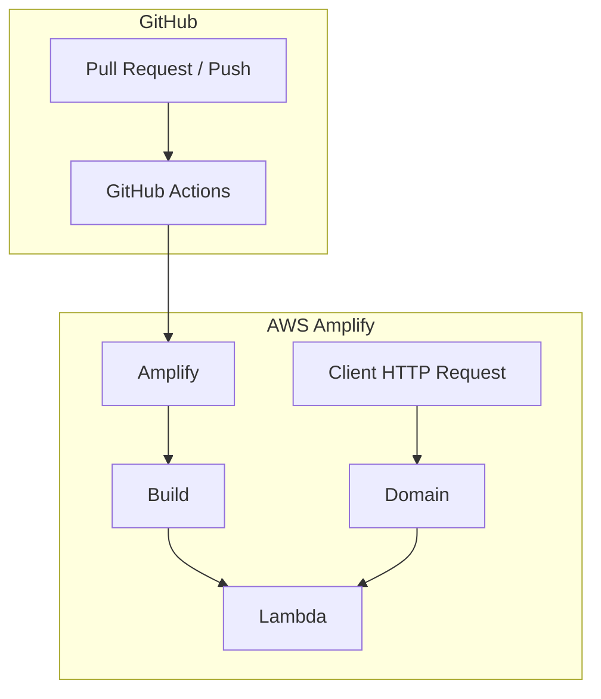
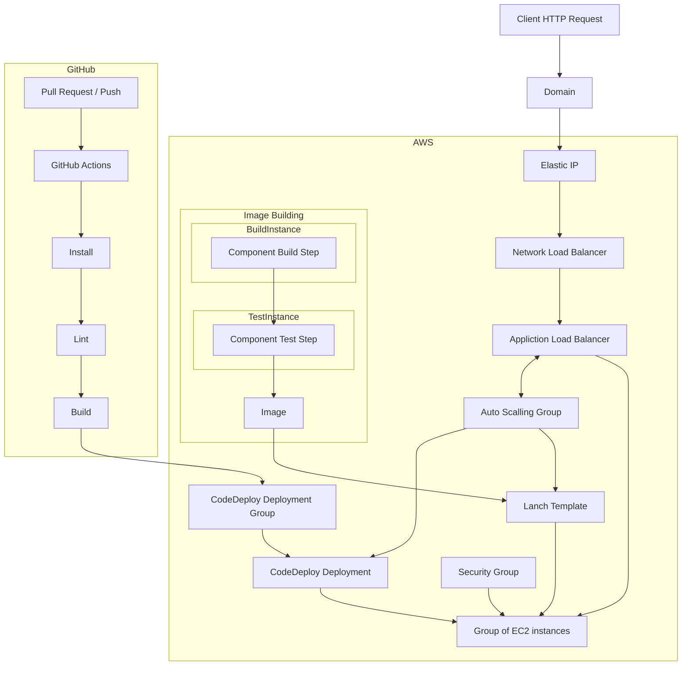
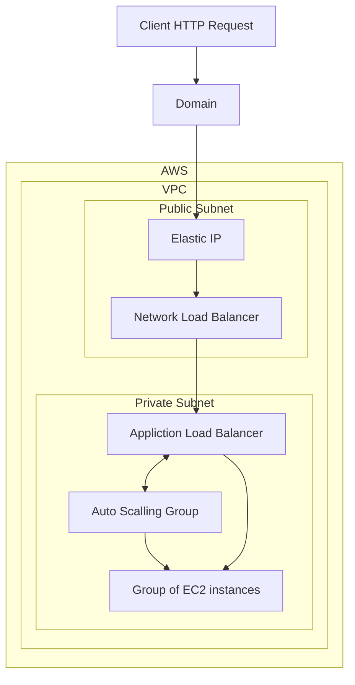

# quality-content-for-children

Science In A Click \
Quality content for children \

* Website: <https://main.d2agpnuowxjy03.amplifyapp.com>
* GitHub: <https://github.com/omer-priel/quality-content-for-children>
* Google Drive: <https://drive.google.com/drive/folders/1Jg3n8xkLEtAfkz5vPlV0N0s7QNT2TxU0>

## Deployment

Now using Amplify


Using Full AWS Infrastructure



Using Full AWS Networking Infrastructure




## Environment Variables

| Name                           | Description                             |
|--------------------------------|-----------------------------------------|
| APP_REVALIDATE                 | Time in seconds of rebuild the App Page |
| GOOGLE_API_KEY                 | Google API Key for Google Sheets API    |
| GOOGLE_SPREADSHEET_ID_CONTENTS | Google Spreadsheet ID of contents sheet |

In local developemt. Create '.env' file in frontent that will contain the Environment Variables.

## Requirements

* nvm

## Install

For install this project run the following commands in the terminal:

```bash
nvm install 16.0.0

nvm use

npm install --global yarn

cd frontend
yarn install
```

## Get Stated

Run the following commands in the terminal:

```bash
bash scripts/start.sh
```

The website will open on <http://localhost:3000/>

## Development CI/CD

Run the following commands in the terminal for run the formatters and linters:

```bash
bash scripts/fix-lint.sh
```

## Production

The production website will be build each time that the main branch is updated

# Authors

* Omer Priel
